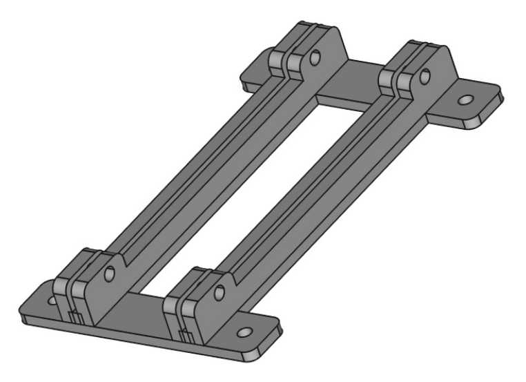

# Dual Bracket for T41 Modules

 

This is a Freecad file design of a dual bracket for the T41 Software Defined Transceiver.
This bracket was designed to hold a QSD and a QSE module, however, it could be used to combine
other modules to create a "super module".

Freecad can be downloaded here:

<https://www.freecad.org/>

An STL file is included in the repository in addition to the Freecad design file.

## A "Super Module" with QSD QSE and Si5351

The dual bracket is intended to allow a special combination of the QSE, QSD, and Si5351 modules.
More specifically, the QSD2 and QSE2 modules which need a very short path from the Si5351 outputs
to the divide-by-two quadrature generator circuits onboard the QSD2 and QSE2.  These digital circuits
need nice sharp waveforms, and the shunt capacitance should be kept to a bare minimum.  The Si5351 outputs
square waves, however, the drive power available is minimal, thus the necessity to keep loading as
low as possible.

A picture is worth a thousand words so here are four photos of the super-module:

<https://drive.google.com/file/d/1rV6BOOSUC20Zmh-siNASb-947YQ3AUHL/view?usp=sharing>

<https://drive.google.com/file/d/12sMDJsfy6aZFSLa1_iZ_5dr99Jdd-2b9/view?usp=sharing>

<https://drive.google.com/file/d/1sfBO62tbnph0H0LEezstMVnIKkGgdY1z/view?usp=sharing>

<https://drive.google.com/file/d/1WYxBKak7jNBUoc0auph26007HgfP-Cj5/view?usp=sharing>

Note the cable from the Si5351 module to the QSE2.  This 4-wire cable provides 5 volts, ground,
and I2C data bus for the Si5351.  Currently this is not used, as the V11 Main board does not
include I2C output.  What I am doing now is a hack of a couple of wires from the Main board
for I2C and a couple more wires which tap 5 volts from the QSD2.  The four wires hacked
onto these boards are attached to a 4-pin connector, which slides onto the Si5351 module pins.

Here are photos showing the how the Si5351 module looks in the radio:

<https://drive.google.com/file/d/1PMoDvv3Jj-5WNvh0fvpFhFMEql-7BHWR/view?usp=sharing>

<https://drive.google.com/file/d/1kvBl7ZV26CweyInujAr7IazBXwgCGwSv/view?usp=sharing>

<https://drive.google.com/file/d/1_QSsvipEbFNr1BmsJ-xMzZSaJ08pZ3Px/view?usp=sharing>

### Cheap Si5351 Modules

Using an Si5351 module instead soldering it to the Main board solves several problems
simultaneously.  The Si5351 device is notoriously difficult to solder, as it uses very fine pitch leads.
The small 25 MHz crystal is also difficult to properly solder, and it can be damaged by overheating.
The module has these parts ready to go including regulators and decoupling.  Even better, the RF
connectors are included!  Here is the module I used from Amazon:

<https://www.amazon.com/gp/product/B09DM96KGS>

Note that the two outer outputs are used, ClK0 and CLK2.
The output in the center, CLK1, is not used.

I used these double-male 90 degree adapters for attaching the Si5351 module to the assembly:

<https://www.amazon.com/gp/product/B07F9V9Q6V>

Note that assembling in this way makes the Super-Module taller.  However, if the CLK input
connectors are rotated 90 degrees, it will be possible to use straight SMA male-male
adapters and the total height will be very close to that of the QSE2 and QSD2 boards.
The Si5351 module will be positioned between the top edges of the two boards.

### Software Configuration for the QSD2/QSE2 Super-Module

The T41EEE firmware for the T41 transceiver can be configured for the QSD2/QSE2 Super-Module.

<https://github.com/Greg-R/T41EEE>

In the file MyConfigurationFile.h:

```
// Uncomment this line if using an external PLL module.
//#define PLLMODULE
```

all you have to do is uncomment one line:
```
// Uncomment this line if using an external PLL module.
#define PLLMODULE
```

This will cause the Si5351 module to be programmed to use the CLK0 and CLK2 outputs as
required for transmit, receive, and calibration.


